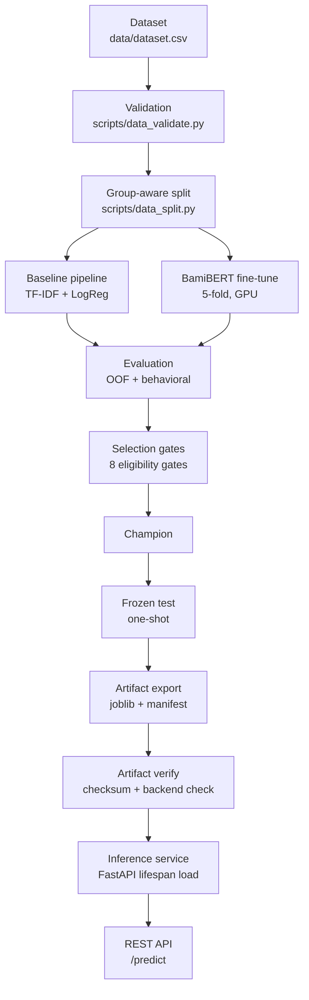
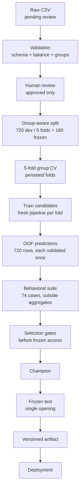
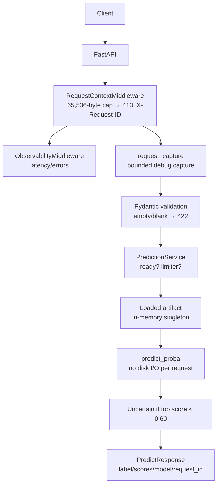

<div align="center">

# MAT

### Vietnamese Automotive Sentiment Intelligence

<p>An end-to-end ML system — from controlled data through training,<br/>evaluation and selection to a versioned, served artifact.</p>

<p><strong>English</strong> · <a href="README.vi.md">Tiếng Việt</a></p>

<p>
<a href="#2-system-architecture">Architecture</a> ·
<a href="#3-ml-lifecycle">Pipeline</a> ·
<a href="#5-modeling-architecture">Models</a> ·
<a href="#6-model-evaluation--selection">Evaluation</a> ·
<a href="#9-api-contract">API</a> ·
<a href="#10-quick-start">Reproduce</a>
</p>

<p>


</p>

<p><sub>DATA&nbsp;&nbsp;→&nbsp;&nbsp;TRAIN&nbsp;&nbsp;→&nbsp;&nbsp;EVALUATE&nbsp;&nbsp;→&nbsp;&nbsp;SELECT&nbsp;&nbsp;→&nbsp;&nbsp;ARTIFACT&nbsp;&nbsp;→&nbsp;&nbsp;SERVE</sub></p>

</div>

> [!IMPORTANT]
> 900 manually-reviewed synthetic samples. Reported metrics measure this controlled dataset — behavioral suite 37/74 is the honest signal, not aggregate F1. **Not production accuracy.**

## 1. Project Overview

| Concern | Implementation |
|---|---|
| Task | 3-class sentiment on Vietnamese car-owner comments |
| Data | 900 curated rows, 300 per label, fully `approved`; 74-case behavioral suite |
| Candidates | TF-IDF + logistic regression baseline · fine-tuned BamiBERT (research-only) |
| Selection | 8 eligibility gates recorded **before** frozen-test access; champion by eligibility, not by max F1 |
| Artifact | `model.joblib` (1.7 MB) + `manifest.json` (checksums, revision, license) |
| Serving | FastAPI `/predict` loading the verified artifact once at startup |
| Deploy | `./run.sh` → Docker Compose (`ai` CPU, `ai-gpu` full-training, `web` demo UI) |

## 2. System Architecture



| Layer | Responsibility | Main implementation |
|---|---|---|
| Data | schema, review status, validation | `ai/data/dataset.csv`, `src/domain/entities.py:DatasetRow`, `src/nlp/training/validation.py:DatasetValidator` |
| Training | 5-fold CV, calibration | `src/nlp/modeling/baseline.py:BaselineTrainer`, `src/nlp/modeling/transformer.py:TransformerTrainer`, `src/nlp/modeling/calibration.py` |
| Evaluation | OOF metrics, slices, behavioral MFT/INV/DIR | `src/nlp/evaluation/metrics.py`, `behavioral.py`, `reporting.py` |
| Selection | 8 gates, champion, one-shot frozen test | `src/nlp/evaluation/selection.py:ChampionSelector` |
| Artifact | manifest schema, save/verify/load | `src/nlp/modeling/registry.py:ArtifactRegistry`, `src/domain/entities.py:ArtifactManifest` |
| Serving | lifespan load, fallback chain, prediction branching | `src/api/dependencies.py`, `src/api/services/prediction_service.py` |
| API | routes, schemas, RFC 9457 errors, middleware | `src/api/v1/endpoints/`, `src/api/error_mapping.py`, `src/api/middlewares/` |
| Infrastructure | CPU/GPU images, compose, one-command runner | `ai/Dockerfile`, `ai/Dockerfile.gpu`, `infra/docker-compose.yml`, `run.sh` |

## 3. ML Lifecycle



**Why group-aware splitting.** Each opinion family shares surface variants; a naive row split would place near-duplicates on both sides and let the model score by memorization. Splitting by `canonical_group_id` (720 dev / 120 groups, 180 frozen / 30 groups, seed 42) keeps variants together — development groups ∩ frozen groups = 0, enforced by `DatasetValidator`.

**Where frozen test enters.** Exactly once, inside `run_frozen_test`, after gates are recorded. A second run against the same decision file is refused (`_refuse_second_frozen_run`). New data requires a new lineage, never a re-open.

## 4. Repository Architecture

```text
MAT/
├── ai/
│   ├── data/          # dataset.csv, split_manifest.json, challenge_set.csv (frozen inputs)
│   ├── configs/       # models.yaml, normalization.yaml + lock (single-source values)
│   ├── src/
│   │   ├── domain/    # entities, contracts, gates (no I/O, no ML)
│   │   ├── nlp/       # preprocessing / training / modeling / evaluation
│   │   ├── api/       # FastAPI, services, middleware, RFC 9457 mapping
│   │   ├── core/      # Settings (MAT_* env), logging
│   │   └── libs/      # Result (Ok/Err) used across layers
│   ├── scripts/       # <stage>_<action> CLIs: data_*, train_*, eval_*, release_*, qa_*, demo_*
│   ├── tests/         # unit / integration / behavioral / architecture boundaries
│   ├── artifacts/     # exported champion (baseline); transformer stays local-only
│   ├── reports/       # evaluations, model-selection, audits (evidence, not code)
│   ├── main.py        # uvicorn entrypoint (mat-serve)
│   └── Dockerfile[.gpu]
├── infra/docker-compose.yml  # ai (CPU) · ai-gpu (profile gpu) · web (3000)
├── frontend/          # Next.js demo, HTTP only, never imports ai/ source
├── docs/superpowers/  # specs, plans, research (design history, not runtime)
├── run.sh             # one-command runner (baseline / transformer)
```

Separation rules enforced by tests (`tests/test_boundaries.py`): `domain/` has no I/O or ML imports, endpoints never import concrete models, production writers resolve only to approved roots, frozen corpus files are never write targets.

## 5. Modeling Architecture

### Baseline (served champion)

```text
Input text
   │
   ▼
TF-IDF word 1–2 gram  +  TF-IDF char_wb 3–5 gram   (min_df 2, sublinear, lowercase)
   │                              │
   └────────── FeatureUnion ───────┘
                    │
                    ▼
        LogisticRegression (C=2.0, balanced, 2000 iter, seed 42)
                    │
                    ▼
   Sigmoid calibration (cross-fitted OOF, 5 persisted fold calibrators)
                    │
                    ▼
        3-class probability distribution (negative/neutral/positive)
```

Implemented in `src/nlp/modeling/baseline.py` (`build_pipeline`), config values owned by `configs/models.yaml` with an equality gate in `scripts/train_baseline.py`. An explicit Vietnamese segmenter (pyvi, `ô tô` → `ô_tô`) exists as an opt-in experiment (`--tokenizer pyvi`): +0.003 OOF F1, identical behavioral score — the served champion keeps the implicit pipeline.

### BamiBERT (research-only)

```text
Raw text (no external segmentation — verified: zero pyvi/underthesea references
in the transformer path; the tokenizer handles raw Vietnamese)
   │
   ▼
BamiBERT AutoTokenizer (pinned revision 57bc134…, resolved at run start, recorded
in runs/transformer/source.json with safetensors + model-card checksums)
   │
   ▼
BamiBERT encoder + fresh 3-class head (lm_head ignored, classifier trained)
   │
   ▼
5-fold fine-tune: lr 2e-5, 4 epochs, batch 16/32, fp16 on CUDA
   │
   ▼
3-class probabilities (raw softmax, no calibration)
```

Implemented in `src/nlp/modeling/transformer.py` (+ `audited_trainer.py` checkpoint reload checks). GPU required; ~395 MB artifact stays local-only (gitignored, excluded from the CPU image). License: BSD-3-Clause-Clear **plus Qualcomm Responsible-AI License, research/educational use only** (`reports/transformer-license-audit.md`) — the reason it cannot be deployed no matter the score.

## 6. Model Evaluation & Selection

| Candidate | OOF macro-F1 | Behavioral | Artifact | Runtime | Eligibility |
|---|---|---|---|---|---|
| Baseline | 0.6377 (calibrated) · frozen 0.6494/180 | 37/74 | 1.7 MB joblib, served | CPU | **eligible — champion** |
| BamiBERT | 0.5808 (raw softmax) | 34/74 | 395 MB, local-only | GPU | ineligible (license) |

Full numbers: `ai/reports/baseline-evaluation.{md,json}`, `transformer-evaluation.{md,json}`. Why these candidates and methods: [model-choice-rationale.md](ai/reports/model-choice-rationale.md).

The 8 gates (`src/domain/evaluation.py:CandidateGates`): `reproducible_five_fold_run`, `no_group_leakage`, `all_required_labels`, `finite_probabilities`, `behavior_report_present`, `artifact_export_supported`, `source_revision_recorded`, `license_approved`. A candidate failing **any** gate cannot win. BamiBERT fails `license_approved`; baseline passes all eight — hence baseline is served despite never having the highest score. Five separable concerns: statistical fit (F1/logloss/Brier), behavioral probes (negation, sarcasm, mixed sentiment), reproducibility (seeded folds, pinned revision), operations (CPU, 1.7 MB, no Hub dependency at serve time), licensing (research-only transformer).

## 7. Training-to-Serving Boundary

```text
Training environment (uv, GPU for transformer, Hub access)
        │  export (frozen-test, one-shot)
        ▼
Versioned artifact: model.joblib + manifest.json
(schema v1, labels, calibration, data_checksum, payload_checksum,
 git_revision, license, evaluation_report)
        │  verify (checksum + backend cross-check)
        ▼
Inference environment (no training code path, no Hub access)
```

The default serving container **never trains**: `ai/Dockerfile` copies the exported `artifacts/` and runs `uvicorn main:app`. Training, verification, and inference are three distinct steps (`train_*` → `release_verify_artifact.py verify` → serve).

Separately, the opt-in GPU bootstrap (`ai/Dockerfile.gpu` + `scripts/release_train_and_serve.py`, compose profile `gpu`) runs the full pipeline from `dataset.csv` on first boot — validate → split → train → evaluate → gates → one-shot frozen-test → verify — then serves. It reuses the exact same CLIs, and skips everything while the persisted artifact still matches the dataset checksum.

## 8. Inference Architecture



Lifecycle (`src/api/dependencies.py`, `src/api/server.py`): at startup (lifespan) the registry **verifies** the artifact, cross-checks the backend, loads it once into a shared `RuntimeState`, and activates the locked normalization catalog. Backend resolution tries the configured backend, falls back across backends, and finally marks the state **degraded** instead of crashing — unready requests get retryable `MODEL_NOT_READY` (503). Exactly one backend is ever consulted per request; failures are reported, never retried elsewhere.

> [!NOTE]
> Known skew (implementation over documentation): the v2 champion was selected on the **normalized** view, but the serving path feeds **raw** request text to the pipeline — no per-request normalization step exists in `PredictionService`/`LinearArtifactModel`. Frozen-test F1 was measured on the precomputed normalized column, so live behavior on raw text may differ slightly. Tracked as a limitation, not hidden.

## 9. API Contract

* `POST /predict` — body `{"text": "..."}` → `{label, confidence, scores{3}, uncertain, model{backend,version,degraded}, request_id}`.
* `GET /livez` — process liveness. `GET /health-check` — model ready + manifest identity.
* Limits: body > 65,536 bytes → 413; empty/blank → 422; model not ready → 503 `MODEL_NOT_READY` (retryable).
* Every response carries `X-Request-ID`. Errors are RFC 9457 `application/problem+json` (`type/title/status/detail/instance/code/request_id`); server errors hide internals.
* `uncertain = confidence < 0.60` (`Settings.uncertain_threshold`) — reported, never used as a correctness guarantee.

```bash
curl -H 'Content-Type: application/json' \
  -d '{"text":"Mazda CX-5 chạy êm, tăng tốc mượt"}' \
  http://127.0.0.1:8000/predict
# {"label":"positive","confidence":0.80,"scores":{...},
#  "uncertain":false,"model":{"backend":"linear","version":"1.0.0","degraded":false},
#  "request_id":"req_..."}
```

## 10. Quick Start

```bash
./run.sh        # asks: 1) Baseline on CPU  2) Transformer from Hub on CPU
```

| Mode | What happens | Needs |
|---|---|---|
| Baseline (1) | Serves the exported artifact + demo UI; sample calls included | Docker |
| Transformer (2) | Fetches the pinned Hub BamiBERT artifact, serves on CPU, no training | Docker + Hub access |

Manual alternative: `docker compose -f infra/docker-compose.yml up --build -d` (API :8000, web :3000). Transformer on CPU: `docker compose --profile trans up --build -d ai-trans`.

## 11. Reproducibility & Quality Gates

* Locked deps (`uv.lock`, `--locked` everywhere) · pinned BamiBERT revision recorded with checksums · seeded group-aware split (seed 42) · YAML owns values / code owns schema with equality gates · registry verify before load.
* `ruff check`, `ruff format --check`, `mypy --strict`, `pytest` (fast suite green except one view-expectation test owned by the normalization task: the v2 artifact declares the normalized view while that test pins the v1 raw-view invariant — see §8/§12; release/performance profiles separated), `uv lock --check`, model-selection gates, frozen corpus write-protection tests.
* Scripts follow `<stage>_<action>` (`data_*`, `train_*`, `eval_*`, `release_*`, `qa_*`, `demo_*`); `mat-*` names are stable entry points.

## 12. Known Limitations

* **Synthetic/curated data.** 900 rows cannot represent real owner speech; benchmark F1 is a pipeline-health signal, not production accuracy.
* **Template-family effects (v1) / narrow coverage (v2).** v1 scores (~1.0) measured memorization of 15 core phrases × 6 wrappers; v2 (0.65) is honest but still small and dialect-thin (northern-standard dominant, teencode sparse).
* **Behavioral weaknesses.** Negation, sarcasm (3–7 cases per phenomenon), mixed sentiment remain the top failure modes (`reports/error_analysis.md` lineage); neutral coverage was 3/60 before the 74-case extension.
* **Train/serve view skew.** See the note in §8: champion selected on normalized view, served on raw text.
* **Tail-latency gate unstable.** The performance profile's tail-latency gate is not a closed gate; a single pass proves nothing.
* **Transformer is research-only** by license and slower/heavier by construction; baseline wins on eligibility, not on capacity.

## 13. Design Decisions

### Why TF-IDF is the production champion
Operational eligibility: CPU inference, 1.7 MB artifact, no Hub dependency at serve time, deterministic retraining, passing all 8 gates. It is the deployable optimum under the project's constraints, not a claim of modeling superiority.

### Why BamiBERT remains research-only
Two independent blockers: the Qualcomm Responsible-AI + BSD-Clear license restricts it to research/education, and it is operationally heavier (GPU, 395 MB). Higher capacity does not override either.

### Why grouped splitting is used
Variants derived from one base intent leak across a row-wise split and inflate scores by memorization (v1 demonstrated this: ~1.0 aggregate vs 23/60 behavioral). Group isolation makes the metric measure generalization.

### Why artifacts are separated from training
The serving image contains no training path, no Hub credentials, and no dataset — only a verified payload + manifest. Training and inference scale, fail, and audit independently.

### Why frozen test is opened only once
Repeated test access turns the test set into a validation set via iterative tuning. The one-shot rule (`_refuse_second_frozen_run`) plus pre-recorded gates is the enforcement mechanism; new data gets a new lineage.

## 14. Reports & Evidence

All evaluation evidence is committed under `ai/reports/` — start here when reviewing:

| Report | What it shows |
|---|---|
| [Model & method rationale](ai/reports/model-choice-rationale.md) ([Tiếng Việt](ai/reports/model-choice-rationale.vi.md)) | Why this split, why these metrics, why these two candidates, why dynamic serving |
| [Model selection & gates](ai/reports/model-selection.md) | The 8 eligibility gates and the champion decision (binding record) |
| [Serving eval](ai/reports/serving-eval/serving-eval.md) | Both backends measured through the live API on frozen-test + challenge, with raw request/response logs (JSONL, same folder) |
| [Baseline evaluation](ai/reports/baseline-evaluation.md) | OOF metrics, slices, confusion matrix, behavioral challenges |
| [Transformer evaluation](ai/reports/transformer-evaluation.md) | Same protocol for the BamiBERT candidate |
| [Transformer champion](ai/reports/transformer-champion.md) | Exported artifact, pinned Hub revision, reproduction command |
| [License audit](ai/reports/transformer-license-audit.md) | BamiBERT license terms and their implications |
| [Dataset card](ai/data/dataset_card.md) | Data provenance, review process, split contract |
