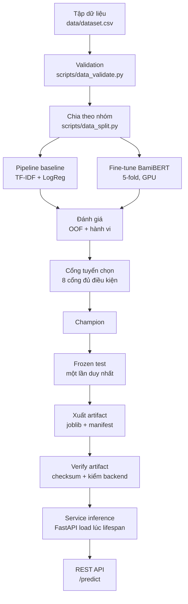
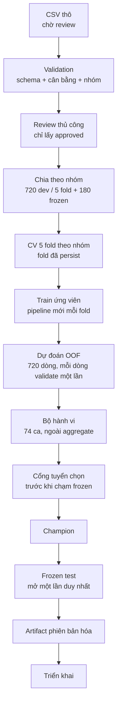
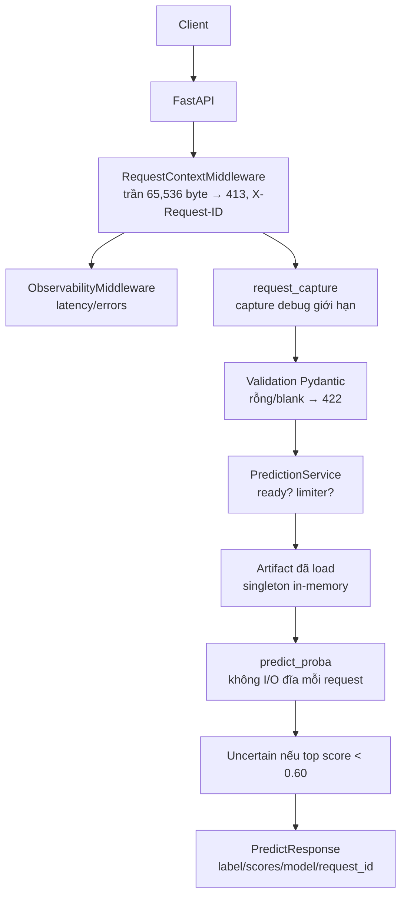

<div align="center">

# MAT

### Trí tuệ cảm xúc ô tô tiếng Việt

<p>Hệ ML end-to-end — từ dữ liệu kiểm soát qua huấn luyện,<br/>đánh giá và tuyển chọn tới artifact phiên bản hóa và phục vụ.</p>

<p><a href="README.md">English</a> · <strong>Tiếng Việt</strong></p>

<p>
<a href="#2-kiến-trúc-hệ-thống">Kiến trúc</a> ·
<a href="#3-vòng-đời-ml">Pipeline</a> ·
<a href="#5-kiến-trúc-mô-hình">Mô hình</a> ·
<a href="#6-đánh-giá-và-tuyển-chọn-mô-hình">Đánh giá</a> ·
<a href="#9-hợp-đồng-api">API</a> ·
<a href="#10-bắt-đầu-nhanh">Tái lập</a>
</p>

<p>


</p>

<p><sub>DỮ LIỆU&nbsp;&nbsp;→&nbsp;&nbsp;HUẤN LUYỆN&nbsp;&nbsp;→&nbsp;&nbsp;ĐÁNH GIÁ&nbsp;&nbsp;→&nbsp;&nbsp;TUYỂN CHỌN&nbsp;&nbsp;→&nbsp;&nbsp;ARTIFACT&nbsp;&nbsp;→&nbsp;&nbsp;PHỤC VỤ</sub></p>

</div>

> [!IMPORTANT]
> 900 mẫu đã rà soát thủ công. Mọi chỉ số chỉ đo trên tập kiểm soát này — tín hiệu thật là bộ hành vi 37/74, không phải F1 tổng hợp. **Không phải accuracy production.**

## 1. Tổng quan dự án

| Hạng mục | Triển khai |
|---|---|
| Bài toán | Phân loại cảm xúc 3 lớp trên bình luận chủ xe tiếng Việt |
| Dữ liệu | 900 dòng curated, 300 mỗi nhãn, đã `approved` toàn bộ; bộ hành vi 74 ca |
| Ứng viên | Baseline TF-IDF + logistic regression · fine-tune BamiBERT (research-only) |
| Tuyển chọn | 8 cổng đủ điều kiện, ghi nhận **trước** khi mở frozen test; chọn theo đủ điều kiện, không theo F1 cao nhất |
| Artifact | `model.joblib` (1.7 MB) + `manifest.json` (checksum, revision, license) |
| Phục vụ | FastAPI `/predict`, load artifact đã verify một lần lúc startup |
| Triển khai | `./run.sh` → Docker Compose (`ai` CPU, `ai-gpu` train toàn phần, `web` demo UI) |

## 2. Kiến trúc hệ thống



| Tầng | Trách nhiệm | Triển khai chính |
|---|---|---|
| Dữ liệu | schema, trạng thái review, validation | `ai/data/dataset.csv`, `src/domain/entities.py:DatasetRow`, `src/nlp/training/validation.py:DatasetValidator` |
| Huấn luyện | CV 5 fold, hiệu chỉnh | `src/nlp/modeling/baseline.py:BaselineTrainer`, `src/nlp/modeling/transformer.py:TransformerTrainer`, `src/nlp/modeling/calibration.py` |
| Đánh giá | metric OOF, cắt lát, hành vi MFT/INV/DIR | `src/nlp/evaluation/metrics.py`, `behavioral.py`, `reporting.py` |
| Tuyển chọn | 8 cổng, champion, frozen test một lần | `src/nlp/evaluation/selection.py:ChampionSelector` |
| Artifact | schema manifest, save/verify/load | `src/nlp/modeling/registry.py:ArtifactRegistry`, `src/domain/entities.py:ArtifactManifest` |
| Phục vụ | load lúc lifespan, chuỗi fallback, rẽ nhánh dự đoán | `src/api/dependencies.py`, `src/api/services/prediction_service.py` |
| API | route, schema, lỗi RFC 9457, middleware | `src/api/v1/endpoints/`, `src/api/error_mapping.py`, `src/api/middlewares/` |
| Hạ tầng | image CPU/GPU, compose, runner một lệnh | `ai/Dockerfile`, `ai/Dockerfile.gpu`, `infra/docker-compose.yml`, `run.sh` |

## 3. Vòng đời ML



**Vì sao chia theo nhóm.** Mỗi họ ý kiến chia sẻ các biến thể bề mặt; chia ngẫu nhiên theo dòng sẽ đặt câu gần giống nhau ở cả hai phía và cho model điểm nhờ học thuộc. Chia theo `canonical_group_id` (720 dev / 120 nhóm, 180 frozen / 30 nhóm, seed 42) giữ các biến thể cùng nhau — nhóm dev ∩ nhóm frozen = 0, `DatasetValidator` bắt buộc.

**Frozen test vào ở đâu.** Đúng một lần, trong `run_frozen_test`, sau khi đã ghi gates. Chạy lần hai vào cùng file quyết định bị từ chối (`_refuse_second_frozen_run`). Dữ liệu mới phải có lineage mới, không bao giờ mở lại.

## 4. Kiến trúc repository

```text
MAT/
├── ai/
│   ├── data/          # dataset.csv, split_manifest.json, challenge_set.csv (input frozen)
│   ├── configs/       # models.yaml, normalization.yaml + lock (giá trị single-source)
│   ├── src/
│   │   ├── domain/    # entities, contracts, gates (không I/O, không ML)
│   │   ├── nlp/       # preprocessing / training / modeling / evaluation
│   │   ├── api/       # FastAPI, services, middleware, ánh xạ RFC 9457
│   │   ├── core/      # Settings (env MAT_*), logging
│   │   └── libs/      # Result (Ok/Err) dùng chung các tầng
│   ├── scripts/       # CLI <giai-đoạn>_<hành-động>: data_*, train_*, eval_*, release_*, qa_*, demo_*
│   ├── tests/         # unit / integration / behavioral / biên kiến trúc
│   ├── artifacts/     # champion đã xuất (baseline); transformer chỉ local
│   ├── reports/       # đánh giá, model-selection, audit (bằng chứng, không phải code)
│   ├── main.py        # entrypoint uvicorn (mat-serve)
│   └── Dockerfile[.gpu]
├── infra/docker-compose.yml  # ai (CPU) · ai-gpu (profile gpu) · web (3000)
├── frontend/          # demo Next.js, chỉ HTTP, không import source ai/
├── docs/superpowers/  # spec, plan, nghiên cứu (lịch sử thiết kế, không phải runtime)
├── run.sh             # runner một lệnh (baseline / transformer)
```

Luật tách lớp do test bắt buộc (`tests/test_boundaries.py`): `domain/` không import I/O hay ML, endpoint không bao giờ import model cụ thể, code production chỉ ghi vào đường dẫn cho phép, file corpus frozen không bao giờ là đích ghi.

## 5. Kiến trúc mô hình

### Baseline (champion đang serve)

```text
Text đầu vào
   │
   ▼
TF-IDF word 1–2 gram  +  TF-IDF char_wb 3–5 gram   (min_df 2, sublinear, lowercase)
   │                              │
   └────────── FeatureUnion ───────┘
                    │
                    ▼
        LogisticRegression (C=2.0, balanced, 2000 iter, seed 42)
                    │
                    ▼
   Hiệu chỉnh sigmoid (cross-fitted OOF, 5 bộ hiệu chỉnh fold đã persist)
                    │
                    ▼
        Phân phối xác suất 3 lớp (negative/neutral/positive)
```

Triển khai ở `src/nlp/modeling/baseline.py` (`build_pipeline`), giá trị config thuộc `configs/models.yaml` với cổng bằng nhau ở `scripts/train_baseline.py`. Bộ tách từ tiếng Việt tường minh (pyvi, `ô tô` → `ô_tô`) tồn tại dưới dạng thí nghiệm opt-in (`--tokenizer pyvi`): +0.003 OOF F1, điểm hành vi y nguyên — champion đang serve giữ pipeline ngầm định.

### BamiBERT (research-only)

```text
Text thô (không tách từ ngoài — đã verify: zero tham chiếu pyvi/underthesea
trong đường transformer; tokenizer tự xử lý tiếng Việt thô)
   │
   ▼
BamiBERT AutoTokenizer (pin revision 57bc134…, resolve lúc chạy, ghi nhận
trong runs/transformer/source.json kèm checksum safetensors + model card)
   │
   ▼
Encoder BamiBERT + head 3 lớp mới (bỏ lm_head, train classifier)
   │
   ▼
Fine-tune 5 fold: lr 2e-5, 4 epoch, batch 16/32, fp16 trên CUDA
   │
   ▼
Xác suất 3 lớp (softmax thô, không hiệu chỉnh)
```

Triển khai ở `src/nlp/modeling/transformer.py` (+ kiểm tra reload checkpoint ở `audited_trainer.py`). Cần GPU; artifact ~395 MB chỉ nằm local (gitignore, loại khỏi image CPU). License: BSD-3-Clause-Clear **cộng Qualcomm Responsible-AI License, chỉ nghiên cứu/giáo dục** (`reports/transformer-license-audit.md`) — lý do nó không được deploy bất kể điểm số.

## 6. Đánh giá và tuyển chọn mô hình

| Ứng viên | OOF macro-F1 | Hành vi | Artifact | Runtime | Đủ điều kiện |
|---|---|---|---|---|---|
| Baseline | 0.6377 (đã hiệu chỉnh) · frozen 0.6494/180 | 37/74 | joblib 1.7 MB, đang serve | CPU | **đủ — champion** |
| BamiBERT | 0.5808 (softmax thô) | 34/74 | 395 MB, chỉ local | GPU | không đủ (license) |

Số đầy đủ: `ai/reports/baseline-evaluation.{md,json}`, `transformer-evaluation.{md,json}`. Vì sao chọn 2 ứng viên và từng phương pháp: [model-choice-rationale.vi.md](ai/reports/model-choice-rationale.vi.md) ([English](ai/reports/model-choice-rationale.md)).

8 cổng (`src/domain/evaluation.py:CandidateGates`): `reproducible_five_fold_run`, `no_group_leakage`, `all_required_labels`, `finite_probabilities`, `behavior_report_present`, `artifact_export_supported`, `source_revision_recorded`, `license_approved`. Rớt **bất kỳ** cổng nào là loại. BamiBERT rớt `license_approved`; baseline qua cả tám — nên baseline được serve dù chưa bao giờ điểm cao nhất. Năm mối quan tâm tách biệt: khớp thống kê (F1/logloss/Brier), probe hành vi (phủ định, châm biếm, cảm xúc lẫn), tái lập (fold seed, revision pin), vận hành (CPU, 1.7 MB, serve không cần Hub), licensing (transformer research-only).

## 7. Ranh giới huấn luyện-phục vụ

```text
Môi trường huấn luyện (uv, GPU cho transformer, quyền Hub)
        │  export (frozen-test, một lần)
        ▼
Artifact phiên bản hóa: model.joblib + manifest.json
(schema v1, labels, calibration, data_checksum, payload_checksum,
 git_revision, license, evaluation_report)
        │  verify (checksum + kiểm backend)
        ▼
Môi trường inference (không đường train, không quyền Hub)
```

Container serve mặc định **không bao giờ train**: `ai/Dockerfile` copy `artifacts/` đã xuất rồi chạy `uvicorn main:app`. Huấn luyện, verify và inference là ba bước riêng (`train_*` → `release_verify_artifact.py verify` → serve).

Riêng bootstrap GPU opt-in (`ai/Dockerfile.gpu` + `scripts/release_train_and_serve.py`, compose profile `gpu`) chạy toàn pipeline từ `dataset.csv` ở lần boot đầu — validate → split → train → evaluate → gates → frozen-test một lần → verify — rồi serve. Nó dùng đúng các CLI đó, và bỏ qua tất cả khi artifact persist còn khớp checksum dataset.

## 8. Kiến trúc inference



Vòng đời (`src/api/dependencies.py`, `src/api/server.py`): lúc startup (lifespan) registry **verify** artifact, kiểm chéo backend, load một lần vào `RuntimeState` dùng chung, và kích hoạt normalization catalog đã lock. Resolution backend thử backend đã cấu hình, fallback qua các backend, cuối cùng đánh dấu **degraded** thay vì crash — request lúc chưa sẵn sàng nhận `MODEL_NOT_READY` (503) có thể retry. Mỗi request chỉ hỏi đúng một backend; lỗi được báo cáo, không bao giờ retry nơi khác.

> [!NOTE]
> Lệch đã biết (implementation hơn documentation): champion v2 được chọn trên view **normalized**, nhưng đường serve đưa text **thô** của request vào pipeline — không có bước chuẩn hóa mỗi request trong `PredictionService`/`LinearArtifactModel`. F1 frozen-test đo trên cột normalized tính sẵn, nên hành vi live trên text thô có thể lệch chút. Đã ghi nhận là giới hạn, không giấu.

## 9. Hợp đồng API

* `POST /predict` — body `{"text": "..."}` → `{label, confidence, scores{3}, uncertain, model{backend,version,degraded}, request_id}`.
* `GET /livez` — liveness tiến trình. `GET /health-check` — model sẵn sàng + danh tính manifest.
* Giới hạn: body > 65.536 byte → 413; rỗng/blank → 422; model chưa sẵn sàng → 503 `MODEL_NOT_READY` (retry được).
* Mọi response mang `X-Request-ID`. Lỗi theo RFC 9457 `application/problem+json` (`type/title/status/detail/instance/code/request_id`); lỗi server che chi tiết nội bộ.
* `uncertain = confidence < 0.60` (`Settings.uncertain_threshold`) — chỉ báo cáo, không bao giờ dùng như bảo đảm đúng.

```bash
curl -H 'Content-Type: application/json' \
  -d '{"text":"Mazda CX-5 chạy êm, tăng tốc mượt"}' \
  http://127.0.0.1:8000/predict
# {"label":"positive","confidence":0.80,"scores":{...},
#  "uncertain":false,"model":{"backend":"linear","version":"1.0.0","degraded":false},
#  "request_id":"req_..."}
```

## 10. Bắt đầu nhanh

```bash
./run.sh        # hỏi: 1) Baseline trên CPU  2) Transformer từ Hub trên CPU
```

| Mode | Chuyện gì xảy ra | Cần gì |
|---|---|---|
| Baseline (1) | Serve artifact đã xuất + demo UI; kèm gọi mẫu | Docker |
| Transformer (2) | Kéo artifact BamiBERT đã pin từ Hub, serve trên CPU, không train | Docker + quyền Hub |

Làm tay: `docker compose -f infra/docker-compose.yml up --build -d` (API :8000, web :3000). Transformer trên CPU: `docker compose --profile trans up --build -d ai-trans`.

## 11. Tái lập và cổng chất lượng

* Deps lock (`uv.lock`, `--locked` mọi nơi) · revision BamiBERT pin có checksum · split theo nhóm có seed (seed 42) · YAML giữ giá trị / code giữ schema với cổng bằng nhau · verify registry trước khi load.
* `ruff check`, `ruff format --check`, `mypy --strict`, `pytest` (suite nhanh xanh trừ một test kỳ vọng view thuộc task normalization: artifact v2 khai normalized view trong khi test đó pin bất biến raw-view của v1 — xem §8/§12; profile release/performance tách riêng), `uv lock --check`, cổng model-selection, test bảo vệ ghi frozen corpus.
* Script theo `<giai-đoạn>_<hành-động>` (`data_*`, `train_*`, `eval_*`, `release_*`, `qa_*`, `demo_*`); tên `mat-*` là entry point ổn định.

## 12. Giới hạn đã biết

* **Dữ liệu synthetic/curated.** 900 dòng không đại diện lời chủ xe thật; F1 benchmark là tín hiệu sức khỏe pipeline, không phải accuracy production.
* **Hiệu ứng họ-template (v1) / phủ hẹp (v2).** Điểm v1 (~1.0) đo khả năng thuộc 15 câu lõi × 6 khung; v2 (0.65) thật hơn nhưng vẫn nhỏ và mỏng phương ngữ (chuẩn miền Bắc trội, teencode thưa).
* **Điểm yếu hành vi.** Phủ định, châm biếm (3–7 ca mỗi hiện tượng), cảm xúc lẫn vẫn là lỗi top (`reports/error_analysis.md` theo lineage); phủ neutral từng chỉ 3/60 trước đợt mở rộng 74 ca.
* **Lệch view train/serve.** Xem note §8: champion chọn trên normalized view, serve trên text thô.
* **Cổng tail-latency bất ổn.** Cổng tail-latency của profile performance chưa phải cổng đã đóng; pass một lần không chứng minh gì.
* **Transformer research-only** vì license, lại nặng/chậm hơn về cấu tạo; baseline thắng nhờ đủ điều kiện, không nhờ capacity.

## 13. Quyết định thiết kế

### Vì sao TF-IDF là champion production
Đủ điều kiện vận hành: inference CPU, artifact 1.7 MB, serve không cần Hub, retrain deterministic, qua cả 8 cổng. Đó là tối ưu deploy được dưới ràng buộc dự án, không phải tuyên bố vượt trội mô hình.

### Vì sao BamiBERT vẫn research-only
Hai blocker độc lập: license Qualcomm Responsible-AI + BSD-Clear chỉ cho nghiên cứu/giáo dục, và nặng hơn về vận hành (GPU, 395 MB). Capacity cao không gỡ được cái nào.

### Vì sao chia theo nhóm
Biến thể từ một ý định gốc leak qua split theo dòng và phình điểm bằng học thuộc (v1 đã chứng minh: aggregate ~1.0 vs hành vi 23/60). Cách ly nhóm buộc metric đo khái quát hóa.

### Vì sao tách artifact khỏi huấn luyện
Image serve không có đường train, credential Hub hay dataset — chỉ payload đã verify + manifest. Huấn luyện và inference scale, fail và audit độc lập.

### Vì sao frozen test chỉ mở một lần
Mở test nhiều lần biến test set thành validation set qua tune lặp. Luật một lần (`_refuse_second_frozen_run`) cộng gates ghi trước là cơ chế bắt buộc; dữ liệu mới phải có lineage mới.

## 14. Báo cáo & bằng chứng

Toàn bộ bằng chứng đánh giá được commit dưới `ai/reports/` — bắt đầu từ đây khi soát bài:

| Báo cáo | Nội dung |
|---|---|
| [Cơ sở chọn mô hình & phương pháp](ai/reports/model-choice-rationale.vi.md) ([English](ai/reports/model-choice-rationale.md)) | Vì sao chia vậy, chọn chỉ số nào, vì sao hai ứng viên này, vì sao serving động |
| [Tuyển chọn & gates](ai/reports/model-selection.md) | 8 cổng đủ điều kiện và quyết định champion (bản ghi ràng buộc) |
| [Serving eval](ai/reports/serving-eval/serving-eval.md) | Cả hai backend đo qua API thật trên frozen-test + challenge, kèm log request/response nguyên vẹn (JSONL, cùng thư mục) |
| [Đánh giá baseline](ai/reports/baseline-evaluation.md) | Metrics OOF, cắt lát, confusion matrix, thử thách hành vi |
| [Đánh giá transformer](ai/reports/transformer-evaluation.md) | Cùng quy trình cho ứng viên BamiBERT |
| [Champion transformer](ai/reports/transformer-champion.md) | Artifact đã xuất, revision Hub đã pin, lệnh tái lập |
| [Audit license](ai/reports/transformer-license-audit.md) | Điều khoản license BamiBERT và hệ quả |
| [Dataset card](ai/data/dataset_card.md) | Nguồn gốc dữ liệu, quy trình review, hợp đồng split |
