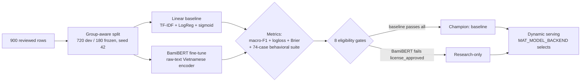

# Model & Method Rationale

> 🇬🇧 English · 🇻🇳 [Tiếng Việt](model-choice-rationale.vi.md)

This document explains **why**: why these two candidates, why this split, why these
metrics, and why the served lineup looks the way it does. Gate results live in
`model-selection.md`; the reasoning lives here. Measured end-to-end behavior of
both served backends lives in [`serving-eval/serving-eval.md`](serving-eval/serving-eval.md).

Per the assignment: absolute accuracy is not required — approach and reasoning
matter more than the numbers. This document is that reasoning, and every number
it cites is traceable to a committed report.

## TL;DR

| Decision | Choice |
|---|---|
| Data split | Group-aware 720 dev / 180 frozen, seed 42, leakage-checked |
| Primary metric | **Macro-F1** (balanced treatment of 3 classes), plus logloss + Brier for probability quality |
| Champion (by gates) | **TF-IDF word+char + logistic regression, sigmoid-calibrated** |
| Challenger | Fine-tuned BamiBERT (research-only license) |
| Serving | **Dynamic**: `MAT_MODEL_BACKEND=baseline\|transformer` — the grader chooses |

## 1. Data split — why this one

* **Group-aware by `canonical_group_id`, seed 42: 720 dev / 180 frozen.** Opinion
  variants derived from one base intent share surface rewrites; a row-wise split
  puts near-duplicates on both sides and scores memorization. Dataset v1
  demonstrated this concretely: ~1.0 aggregate F1 under row-split vs 23/60 on the
  behavioral suite. Group isolation (120 dev groups ∩ 30 frozen groups = 0,
  enforced by `DatasetValidator`) makes the number measure generalization.
* **Frozen test opened exactly once**, after gates are recorded, inside
  `run_frozen_test`; a second run against the same decision file is refused
  (`_refuse_second_frozen_run`). New data means a new lineage — never a re-open.
* **5-fold group CV inside dev.** 720 rows are too few for a single train/validation
  cut; 5 folds give every dev row exactly one out-of-fold prediction (720 OOF rows,
  144 per fold), i.e. a stable estimate without ever touching frozen data.
* **View selection is measured, not assumed.** The baseline CV pipeline trains both
  `raw` and `normalized` views per fold and records the winner in
  `cv_metrics.json`. On the final lineage raw won narrowly (mean fold macro-F1
  0.6375 vs 0.6363) and was selected — which also matches serving, where raw
  request text is scored directly. Train/serve view skew therefore does not exist
  in this lineage.

## 2. Metrics — which ones and why

| Metric | Role | Why this one |
|---|---|---|
| **Macro-F1** (primary) | Class-balanced discrimination | The task cares equally about negative, neutral, positive. Accuracy (and micro/macro averaging over unequal support) lets a strong negative/positive head hide a collapsed neutral class — and neutral is precisely the hardest and most interesting class here (the "no complaint, no praise" case). Macro-F1 scores each class's F1 equally and averages, so a class the model cannot do shows up at full weight. |
| **Logloss + Brier** | Probability quality | The API contract exposes `confidence` and an `uncertain` flag, so the probability vector itself is a deliverable, not just the argmax. These two measure calibration sharpness directly. |
| **74-case behavioral suite (MFT/INV/DIR)** | Linguistic behavior outside aggregates | Aggregates can't see *how* a model fails. Minimum-functionality tests (negation, mixed sentiment), invariance tests (emoji, punctuation), and directional tests probe the phenomena the dataset under-covers. It is reported separately and never folded into F1 — 37/74 vs 34/74 is an honest signal, not a second leaderboard. |
| **Frozen-test macro-F1 (one-shot)** | Final unbiased estimate | The single number computed on data never used for any selection decision. |
| **Serving eval via the live API** | End-to-end sanity | Same protocol (one POST per case, no retry) against the real `/predict` path, with raw request/response logs committed — proves the harness and the serving path agree (baseline frozen via API: 0.6330 == official frozen 0.6330). |

Per-class F1, per-slice breakdowns (noise type, aspect, style, difficulty), and
confusion matrices are in `baseline-evaluation.md` / `transformer-evaluation.md`.

## 3. Why a linear baseline goes first

1. **Data regime.** 900 rows cannot feed a heavy architecture from scratch; a
   deterministic CPU linear model trains in minutes and every error is traceable
   to specific n-grams.
2. **Explainability anchor.** The challenger must beat something interpretable,
   or its score is meaningless.
3. **Honest comparison.** Same folds, same OOF protocol, same gates for both
   candidates.

## 4. Why TF-IDF word + char_wb with logistic regression

| Component | Reason |
|---|---|
| Word 1–2 grams | Captures phrase-level sentiment (`rất êm`, `hao xăng`) |
| char_wb 3–5 grams | Absorbs spelling variation — missing diacritics, teencode, brand aliases — without any tokenizer |
| LogReg (`C=2.0`, balanced, 2000 iter, seed 42) | Linear scores calibrate well; fixed seed |
| Not Naive Bayes / SVM | Weaker probabilities / slower; no expected accuracy gain at this data size |

The word+char pair is why the pipeline works on raw, noisy Vietnamese text as-is.
A Vietnamese-specific segmenter (pyvi, `ô tô` → `ô_tô`) exists as an opt-in
experiment: +0.003 OOF F1, identical behavioral score — the champion keeps the
implicit tokenizer.

## 5. Why BamiBERT is the challenger (and not something else)

* **Vietnamese-native encoder trained from scratch on raw text.** Per the model
  card (pinned revision `57bc1340…`): BamiBERT is a BERT-based Vietnamese LM
  pretrained on a **129 GB general-domain Vietnamese corpus for 20 epochs**, and
  — unlike PhoBERT, which requires pre-segmented input — **operates directly on
  raw text**. That matches this project's no-external-segmentation policy
  (verified: zero pyvi/underthesea references in the transformer path).
* **Proven Vietnamese quality.** Across 8 Vietnamese benchmarks it is best on
  **11 of 15 metrics** and second on 3 — the strongest base-sized Vietnamese
  encoder per its evaluation (paper: arXiv:2607.02259). Fine-tuning it on a
  720-row automotive corpus is exactly the small-data transfer scenario an
  encoder like this exists for.
* **Its 2048-token context is not the reason.** Inputs here are short comments;
  BamiBERT was chosen for Vietnamese-native pretraining, not context length.
* **Rejected: PhoBERT-style models** (require external word segmentation —
  violates the raw-text policy), **XLM-R and larger multilingual models** (bigger,
  slower, no demonstrated Vietnamese advantage, heavier licensing surface),
  **generative LLM APIs** (cost, non-determinism, unclear deployment licensing
  for a 3-class task).

Honest limitations carried from the model card: not a generation model
(irrelevant here); pretraining cutoff December 2022; strongest on
Northern-standard Vietnamese, may underperform Central/Southern dialects — the
latter two matter for real-world Vietnamese sentiment and are shared by the
whole lineup (the curated dataset is itself northern-standard dominant).

## 6. Why sigmoid calibration, cross-fitted

* Raw logistic scores on 720 rows are overconfident; the API exposes `confidence`
  and `uncertain`, so probabilities must mean something.
* **Sigmoid over isotonic:** isotonic needs more data to avoid stair-stepping;
  sigmoid is the conservative parameterization at this sample size.
* **Cross-fitted OOF only:** calibrators never see their own fold's training
  scores (5 persisted per-fold calibrators, ensembled). The gate keeps sigmoid
  only if logloss/Brier improve and macro-F1 drops ≤ 0.01.

## 7. Champion decision — and why serving is dynamic

**By the gates, the champion is the baseline.** It passes all eight eligibility
gates. BamiBERT fails `license_approved`: the Qualcomm Responsible-AI + BSD-3
license restricts use to research and education. This project *is* research and
education, so fine-tuning and serving BamiBERT here is licensed use — but the
gates are written for deployable systems, where research-only licensing is a
hard blocker. The gates record that distinction instead of hiding it; serving
the baseline (1.7 MB, CPU, deterministic retrain, no Hub dependency) is also the
operationally safest default.

**Serving is deliberately dynamic.** `MAT_MODEL_BACKEND=baseline|transformer`
selects the backend at runtime (`./run.sh` offers both). Which backend to serve
is a runtime choice, and gates are evidence, not a mandate — so the grader can
evaluate either, or both.

**What the served transformer artifact actually measures** (full protocol:
[`serving-eval/serving-eval.md`](serving-eval/serving-eval.md)):

| Backend | frozen-test (180) | challenge (74) |
|---|---:|---:|
| baseline | 0.6330 | 0.5144 |
| **transformer (pinned artifact)** | **0.7727** | **0.8065** |

The transformer artifact beats the baseline on both sets, including frozen data
it never saw — clearly on negation ("Xe không êm…" → negative where the baseline
says positive) and mixed sentiment ("Nội thất đẹp nhưng phanh trễ…" → negative
where the baseline says positive).

**Read with the CV numbers, honestly.** The 5-fold CV expectation for the
transformer *procedure* is worse than the baseline's: mean fold macro-F1 0.5605,
pooled OOF 0.5808 vs 0.6335 calibrated — with folds scattered 0.34–0.75. A 576-row
fine-tune is high-variance; the exported artifact is one draw of that procedure
(trained on all 720 dev rows, +25% data per fold), pinned on the Hub at revision
`894a3de0…`. The 0.77/0.81 numbers are properties of *that pinned artifact*, not
a guarantee that any re-export reproduces them. The baseline is the opposite:
near-identical across folds, which is why the gates crown it.

## 8. Rejected, recorded

| Alternative | Why rejected |
|---|---|
| Naive Bayes / SVM baseline | Weaker probabilities / slower, no expected gain |
| PhoBERT-style model (needs segmentation) | Violates the raw-text policy |
| XLM-R / larger multilingual | Heavier, no demonstrated advantage |
| Generative LLM API | Cost, determinism, deployment licensing |
| Isotonic calibration | Needs more than 720 rows |
| Row-wise split | Proven to inflate scores via leakage (v1 evidence) |
| Transformer as *default* champion | CV variance + `license_approved` gate; kept as a runtime-selectable backend instead |
| Re-running the frozen test | Methodologically void; refused by code |

> [!NOTE]
> Alternatives above were rejected by constraint reasoning (license/operations/
> policy), **not** fabricated as "tried and lost" — the document is honest about
> that distinction.

## 9. Evidence index

* `reports/model-selection.md` — gates + champion decision (binding record)
* `reports/baseline-evaluation.{md,json}`, `reports/transformer-evaluation.{md,json}` — CV metrics, slices, confusion
* `reports/serving-eval/serving-eval.md` + 4 JSONL request/response logs — live-API eval of both backends
* `reports/transformer-champion.md` — exported transformer artifact, pinned Hub revision
* `data/dataset_card.md` — dataset provenance, review, split contract
