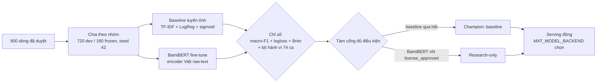

# Cơ sở lựa chọn mô hình và phương pháp

> 🇻🇳 Tiếng Việt · 🇬🇧 [English](model-choice-rationale.md)

Tài liệu này giải thích **vì sao**: vì sao chọn hai ứng viên này, chia dữ liệu vậy,
chọn chỉ số kia, và vì sao đội hình serving nhìn như hiện tại. Kết quả gates nằm ở
`model-selection.md`; lý lẽ nằm ở đây. Hành vi đo được end-to-end của cả hai
backend nằm ở [`serving-eval/serving-eval.md`](serving-eval/serving-eval.md).

Theo yêu cầu đề bài: không cần độ chính xác tuyệt đối — cách tiếp cận và lý luận
quan trọng hơn kết quả số. Tài liệu này chính là phần lý luận đó, và mọi con số
nó nêu đều truy được về một báo cáo đã commit.

## Kết luận (TL;DR)

| Quyết định | Lựa chọn |
|---|---|
| Chia dữ liệu | Theo nhóm 720 dev / 180 frozen, seed 42, kiểm tra leak |
| Chỉ số chính | **Macro-F1** (đối xử cân bằng 3 lớp), kèm logloss + Brier cho chất lượng xác suất |
| Champion (theo gates) | **TF-IDF word+char + logistic regression, hiệu chỉnh sigmoid** |
| Challenger | Fine-tune BamiBERT (license research-only) |
| Serving | **Động**: `MAT_MODEL_BACKEND=baseline\|transformer` — người chấm tự chọn |

## 1. Chia dữ liệu — vì sao chia vậy

* **Theo nhóm `canonical_group_id`, seed 42: 720 dev / 180 frozen.** Các biến thể
  ý kiến từ một ý gốc chia sẻ cách viết lại bề mặt; chia theo dòng sẽ đặt câu gần
  giống nhau ở cả hai phía và đo khả năng học thuộc. Dataset v1 đã chứng minh cụ
  thể: aggregate ~1.0 khi chia theo dòng vs 23/60 trên bộ hành vi. Cách ly nhóm
  (120 nhóm dev ∩ 30 nhóm frozen = 0, `DatasetValidator` bắt buộc) buộc con số
  đo khái quát hóa.
* **Frozen test mở đúng một lần**, sau khi ghi gates, trong `run_frozen_test`;
  chạy lần hai vào cùng file quyết định bị từ chối (`_refuse_second_frozen_run`).
  Dữ liệu mới thì lineage mới — không bao giờ mở lại.
* **CV 5 fold theo nhóm trong dev.** 720 dòng quá ít cho một cặp train/validation
  đơn; 5 fold cho mỗi dòng dev đúng một dự đoán out-of-fold (720 dòng OOF, 144
  dòng/fold) — ước lượng ổn định mà không chạm frozen.
* **Chọn view bằng đo đạc, không giả định.** Pipeline CV baseline train cả hai
  view `raw` và `normalized` mỗi fold rồi ghi view thắng vào `cv_metrics.json`.
  Trên lineage cuối, raw thắng sít sao (mean fold macro-F1 0.6375 vs 0.6363) và
  được chọn — đồng thời khớp serving, nơi text thô của request được chấm trực
  tiếp. Lệch view train/serve vì vậy không tồn tại ở lineage này.

## 2. Chỉ số — chọn gì và vì sao

| Chỉ số | Vai trò | Vì sao chọn |
|---|---|---|
| **Macro-F1** (chính) | Phân biệt cân bằng theo lớp | Bài toán quan tâm đều negative, neutral, positive. Accuracy (hay micro/macro trên support lệch) cho đầu negative/positive mạnh che lớp neutral sụp — mà neutral lại là lớp khó và thú vị nhất ở đây (trường hợp "không khen không chê"). Macro-F1 tính F1 từng lớp ngang hàng rồi lấy trung bình, nên lớp nào model không làm được hiện lên với trọng số đầy đủ. |
| **Logloss + Brier** | Chất lượng xác suất | Hợp đồng API phơi `confidence` và cờ `uncertain`, nên vector xác suất là sản phẩm, không chỉ argmax. Hai chỉ số này đo trực tiếp độ sắc của hiệu chỉnh. |
| **Bộ hành vi 74 ca (MFT/INV/DIR)** | Hành vi ngôn ngữ ngoài aggregate | Aggregate không nhìn được model *sai kiểu gì*. Minimum-functionality test (phủ định, cảm xúc trộn), invariance test (emoji, dấu câu), directional test soi đúng các hiện tượng dataset phủ mỏng. Bộ này báo cáo riêng, không bao giờ gộp vào F1 — 37/74 vs 34/74 là tín hiệu trung thực, không phải bảng xếp hạng thứ hai. |
| **Frozen-test macro-F1 (một lần)** | Ước lượng cuối không chệch | Con số duy nhất tính trên dữ liệu chưa từng tham gia quyết định nào. |
| **Serving eval qua API thật** | Kiểm end-to-end | Cùng giao thức (mỗi ca một POST, không retry) trên đường `/predict` thật, kèm log request/response nguyên vẹn đã commit — chứng minh harness và đường serving khớp nhau (baseline frozen qua API: 0.6330 == frozen chính thức 0.6330). |

F1 theo lớp, cắt lát (noise, aspect, style, difficulty), confusion matrix: xem
`baseline-evaluation.md` / `transformer-evaluation.md`.

## 3. Vì sao baseline tuyến tính đi trước

1. **Chế độ dữ liệu.** 900 dòng không nuôi nổi kiến trúc nặng từ số 0; model
   tuyến tính CPU train vài phút, deterministic, mỗi lỗi truy được tới từng n-gram.
2. **Mốc so sánh giải thích được.** Challenger phải thắng một cái gì đó hiểu nổi,
   nếu không điểm của nó vô nghĩa.
3. **So sánh trung thực.** Cùng fold, cùng quy trình OOF, cùng gates cho cả hai.

## 4. Vì sao TF-IDF word + char_wb với logistic regression

| Thành phần | Lý do |
|---|---|
| Word 1–2 gram | Bắt cảm xúc cấp cụm từ (`rất êm`, `hao xăng`) |
| char_wb 3–5 gram | Hứng biến thể chính tả — mất dấu, teencode, alias hãng — mà không cần tách từ |
| LogReg (`C=2.0`, balanced, 2000 iter, seed 42) | Điểm tuyến tính hợp hiệu chỉnh, seed cố định |
| Bỏ Naive Bayes / SVM | Xác suất kém / chậm hơn, không hứa tăng accuracy ở cỡ dữ liệu này |

Cặp word+char là lý do pipeline chạy được trên text Việt thô/nhiễu ngay từ đầu.
Bộ tách từ tiếng Việt (pyvi, `ô tô` → `ô_tô`) tồn tại dưới dạng thí nghiệm
opt-in: +0.003 OOF F1, điểm hành vi y nguyên — champion giữ tokenizer ngầm định.

## 5. Vì sao BamiBERT làm challenger (và không phải cái khác)

* **Encoder Việt native, train từ số 0 trên raw text.** Theo model card (revision
  pin `57bc1340…`): BamiBERT là LM tiếng Việt kiểu BERT pretrain trên corpus
  tiếng Việt general-domain **129 GB trong 20 epochs**, và — khác PhoBERT đòi
  input tách từ trước — **chạy trực tiếp trên text thô**. Điều đó khớp đúng policy
  không-tách-từ-ngoài của dự án (đã verify: zero tham chiếu pyvi/underthesea
  trong đường transformer).
* **Chất lượng tiếng Việt đã chứng minh.** Trên 8 benchmark tiếng Việt, BamiBERT
  đạt best ở **11/15 metrics**, second ở 3 — encoder base-size tiếng Việt mạnh
  nhất theo đánh giá của nó (paper: arXiv:2607.02259). Fine-tune nó trên corpus
  ô tô 720 dòng đúng là kịch bản transfer dữ liệu nhỏ mà loại encoder này sinh
  ra để làm.
* **Context 2048 không phải lý do.** Input ở đây là comment ngắn; chọn BamiBERT
  vì pretrain Việt native, không vì context dài.
* **Loại: model kiểu PhoBERT** (cần tách từ ngoài — trái policy raw-text),
  **XLM-R và model đa ngữ lớn hơn** (to hơn, chậm hơn, không có lợi thế Việt đã
  chứng minh, bề mặt license nặng hơn), **LLM API generative** (chi phí, không
  deterministic, licensing deploy mơ hồ cho bài toán 3 lớp).

Hạn chế trung thực lấy từ model card: không phải model generation (không liên
quan ở đây); pretrain cắt tại 12/2022; mạnh nhất trên tiếng Việt chuẩn miền Bắc,
có thể kém hơn với phương ngữ Trung/Nam — hai điểm sau quan trọng với sentiment
tiếng Việt ngoài đời và là điểm chung của cả đội hình (dataset curated cũng trội
chuẩn miền Bắc).

## 6. Vì sao hiệu chỉnh sigmoid, cross-fitted

* Điểm logistic thô trên 720 dòng quá tự tin; API phơi `confidence` và
  `uncertain`, nên xác suất phải có nghĩa.
* **Sigmoid thay vì isotonic:** isotonic cần nhiều data hơn để khỏi bậc thang;
  sigmoid là lựa chọn tham số bảo thủ ở cỡ mẫu này.
* **Chỉ cross-fitted OOF:** calibrator không bao giờ thấy điểm train của fold
  chính nó (5 bộ hiệu chỉnh fold đã persist, ghép ensemble). Cổng chỉ giữ sigmoid
  nếu logloss/Brier cải thiện và macro-F1 rớt ≤ 0.01.

## 7. Quyết định champion — và vì sao serving động

**Theo gates, champion là baseline.** Nó qua cả tám cổng đủ điều kiện. BamiBERT
rớt `license_approved`: license Qualcomm Responsible-AI + BSD-3 giới hạn sử dụng
cho nghiên cứu và giáo dục. Dự án này *đúng là* nghiên cứu/giáo dục, nên
fine-tune và serve BamiBERT ở đây là dùng đúng license — nhưng gates viết cho
hệ thống deploy được, nơi license research-only là blocker cứng. Gates ghi nhận
điều đó thay vì giấu đi; serve baseline (1.7 MB, CPU, retrain deterministic,
không cần Hub lúc serve) cũng là mặc định an toàn vận hành nhất.

**Serving được thiết kế động.** `MAT_MODEL_BACKEND=baseline|transformer` chọn
backend lúc runtime (`./run.sh` đưa cả hai). Serve backend nào là lựa chọn
runtime, gates chỉ là bằng chứng chứ không phải mệnh lệnh — nên người chấm có
thể đánh giá cái này, cái kia, hoặc cả hai.

**Artifact transformer đang serve đo được gì** (giao thức đầy đủ:
[`serving-eval/serving-eval.md`](serving-eval/serving-eval.md)):

| Backend | frozen-test (180) | challenge (74) |
|---|---:|---:|
| baseline | 0.6330 | 0.5144 |
| **transformer (artifact đang pin)** | **0.7727** | **0.8065** |

Artifact transformer vượt baseline trên cả hai tập, kể cả frozen chưa từng thấy —
rõ nhất ở phủ định (*"Xe không êm…"* → negative trong khi baseline nói positive)
và cảm xúc trộn (*"Nội thất đẹp nhưng phanh trễ…"* → negative trong khi baseline
nói positive).

**Nhưng phải đọc cùng số CV, trung thực.** Kỳ vọng CV 5-fold của *quy trình*
transformer kém hơn baseline: mean fold macro-F1 0.5605, OOF gộp 0.5808 so với
0.6335 calibrated — với fold rải 0.34–0.75. Fine-tune 576 dòng là quy trình
variance cao; artifact export là *một lượt rút* của quy trình đó (train trên đủ
720 dòng dev, +25% dữ liệu mỗi fold), đã pin trên Hub ở revision `894a3de0…`.
Con số 0.77/0.81 là đặc tính của *artifact đang pin*, không phải cam kết rằng
mọi lần export lại tái lập được. Baseline thì ngược lại: gần như y nhau giữa các
fold — đó là lý do gates chọn nó.

## 8. Đã loại, ghi nhận

| Phương án | Lý do loại |
|---|---|
| Naive Bayes / SVM baseline | Xác suất kém / chậm hơn, không kỳ vọng tăng |
| Model kiểu PhoBERT (cần tách từ) | Trái policy raw-text |
| XLM-R / đa ngữ lớn hơn | Nặng hơn, không lợi thế đã chứng minh |
| LLM API generative | Chi phí, determinism, licensing deploy |
| Hiệu chỉnh isotonic | Cần nhiều hơn 720 dòng |
| Chia split theo dòng | Đã chứng minh phình điểm do leak (bằng chứng v1) |
| Transformer làm champion *mặc định* | Variance CV + cổng `license_approved`; thay vào đó giữ làm backend chọn được lúc runtime |
| Chạy lại frozen test | Vô giá trị phương pháp luận; code từ chối |

> [!NOTE]
> Các phương án trên bị loại bằng lập luận ràng buộc (license/vận hành/policy),
> **không** bịa là "đã thử và thua" — tài liệu trung thực ở điểm này.

## 9. Chỉ mục bằng chứng

* `reports/model-selection.md` — gates + quyết định champion (bản ghi ràng buộc)
* `reports/baseline-evaluation.{md,json}`, `reports/transformer-evaluation.{md,json}` — metrics CV, cắt lát, confusion
* `reports/serving-eval/serving-eval.md` + 4 file log JSONL request/response — eval qua API thật của cả hai backend
* `reports/transformer-champion.md` — artifact transformer đã xuất, revision Hub đã pin
* `data/dataset_card.md` — nguồn gốc dataset, review, hợp đồng split
